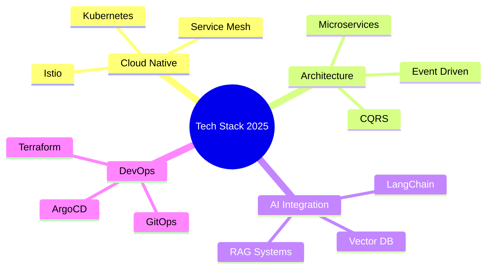

# <div align="center">DANG QUOC HUY</div>

<div align="center">
  
</div>

<div align="center">
  <picture>
    <source media="(prefers-color-scheme: dark)" srcset="https://readme-typing-svg.demolab.com?font=Fira+Code&weight=600&size=28&duration=3000&pause=1000&color=00D9FF&center=true&vCenter=true&width=600&lines=Full-Stack+Engineer;Cloud+Architect;DevOps+Specialist;AI+Integration+Expert">
    
  </picture>
</div>

<div align="center">
  <a href="https://github.com/danieldev23"></a>
  <a href="https://github.com/danieldev23?tab=stars"></a>
  <a href="https://visitcount.itsvg.in"></a>
</div>

---

## 🎯 Professional Overview

<table>
<tr>
<td width="60%">

### About Me

I'm a **Junior Full-Stack Developer** with 2+ years of experience building scalable, high-performance applications. Based in Vietnam 🇻🇳, I specialize in transforming complex business requirements into elegant technical solutions.

**Current Focus:**
- 🚀 Building AI-powered enterprise platforms
- ☁️ Architecting cloud-native microservices
- 📊 Optimizing system performance and reliability
- 🔧 Implementing DevOps best practices

**Philosophy:**  
*"Clean code, scalable architecture, and continuous learning drive exceptional software."*

</td>
<td width="40%">

```typescript
const developer = {
  name: "Dang Quoc Huy",
  role: "Junior Fullstack Developer",
  location: "Vietnam 🇻🇳",
  experience: "2+ years",
  
  currentlyLearning: [
    "Kubernetes & K8s Operators",
    "GraphQL Federation",
    "Terraform & IaC",
    "System Design Patterns"
  ],
  
  interests: [
    "Microservices Architecture",
    "AI/ML Integration",
    "Cloud Engineering",
    "Open Source"
  ]
};
```

</td>
</tr>
</table>

---

## 📊 GitHub Analytics

<div align="center">
  <picture>
    <source media="(prefers-color-scheme: dark)" srcset="https://github-readme-stats.vercel.app/api?username=danieldev23&show_icons=true&theme=transparent&hide_border=true&title_color=00d9ff&icon_color=00d9ff&text_color=e6edf3&bg_color=0d1117&count_private=true&include_all_commits=true">
    
  </picture>
  <picture>
    <source media="(prefers-color-scheme: dark)" srcset="https://github-readme-streak-stats.herokuapp.com/?user=danieldev23&theme=transparent&hide_border=true&background=0d1117&stroke=00d9ff&ring=00d9ff&fire=00d9ff&currStreakLabel=00d9ff">
    
  </picture>
</div>

<div align="center">
  <picture>
    <source media="(prefers-color-scheme: dark)" srcset="https://github-readme-stats.vercel.app/api/top-langs/?username=danieldev23&layout=compact&theme=transparent&hide_border=true&title_color=00d9ff&text_color=e6edf3&bg_color=0d1117&langs_count=8">
    
  </picture>
</div>

<div align="center">
  <picture>
    <source media="(prefers-color-scheme: dark)" srcset="https://github-readme-activity-graph.vercel.app/graph?username=danieldev23&custom_title=Contribution%20Graph&bg_color=0d1117&color=00d9ff&line=00d9ff&point=e6edf3&area=true&hide_border=true">
    
  </picture>
</div>

---

## 🛠️ Technology Stack

<details open>
<summary><b>Frontend Development</b></summary>
<br/>

<div align="center">


</div>
</details>

<details open>
<summary><b>Backend Development</b></summary>
<br/>

<div align="center">


</div>
</details>

<details open>
<summary><b>Database & Caching</b></summary>
<br/>

<div align="center">


</div>
</details>

<details open>
<summary><b>Cloud & DevOps</b></summary>
<br/>

<div align="center">


</div>
</details>

<details open>
<summary><b>Tools & Platforms</b></summary>
<br/>

<div align="center">


</div>
</details>

---

## 🚀 Featured Projects

<div align="center">

<table>
<tr>
<td width="50%" valign="top">

### 🎨 E-Commerce Platform
**Modern marketplace with AI recommendations**


**Features:**
- Real-time inventory management
- AI-powered product recommendations
- Secure payment integration
- Admin dashboard with analytics

</td>
<td width="50%" valign="top">

### 📊 Analytics Dashboard
**Real-time data visualization platform**


**Highlights:**
- Custom chart components
- Real-time WebSocket updates
- Export to multiple formats
- Role-based access control

</td>
</tr>
<tr>
<td width="50%" valign="top">

### 🤖 AI Content Generator
**GPT-powered content creation tool**


**Capabilities:**
- Multi-language support
- Content optimization
- Plagiarism detection
- API integration

</td>
<td width="50%" valign="top">

### 🔐 Authentication Service
**Microservice for secure auth**


**Implementation:**
- OAuth 2.0 & JWT
- Rate limiting
- Session management
- 2FA support

</td>
</tr>
</table>

</div>

---

## 📈 Key Achievements

<div align="center">

| Metric | Achievement |
|:------:|:----------:|
| 🏆 **Projects Delivered** | 15+ production applications |
| ⚡ **Performance** | 200-300% optimization gains |
| 🎯 **System Uptime** | 99.9% reliability maintained |
| 👥 **Team Collaboration** | 10+ cross-functional projects |
| 📚 **Open Source** | 25+ contributions |

</div>

---

## 🌱 Learning Journey

<div align="center">

**Currently Exploring:**



</div>

---

## 📫 Connect With Me

<div align="center">

[](https://www.dangquochuy.id.vn/)
[](https://www.linkedin.com/in/dangquochuy/)
[](https://github.com/danieldev23)
[](mailto:dangquochuy.connect@gmail.com)

</div>

---

## 💼 Services & Expertise

<table align="center">
<tr>
<td align="center" width="33%">

**🎨 Frontend Development**
- Responsive web applications
- Modern UI/UX implementation
- Performance optimization
- Cross-browser compatibility

</td>
<td align="center" width="33%">

**⚙️ Backend Development**
- RESTful & GraphQL APIs
- Microservices architecture
- Database design & optimization
- Third-party integrations

</td>
<td align="center" width="33%">

**☁️ Cloud & DevOps**
- CI/CD pipeline setup
- Container orchestration
- Infrastructure as Code
- Monitoring & logging

</td>
</tr>
</table>

---

## 🎯 2025 Goals

<div align="center">

- [ ] 🚀 Launch 3 open-source projects
- [ ] 📝 Write 12 technical blog posts
- [ ] 🎤 Speak at 2 tech conferences
- [ ] 🏆 Earn AWS Solutions Architect certification
- [x] 💻 Master Kubernetes & cloud-native development
- [ ] 🤝 Mentor 5+ junior developers

</div>

---

<div align="center">
  
</div>

<div align="center">

### 💡 *"Code with purpose, build with passion, learn continuously"*


---

<sub>⭐ From [danieldev23](https://github.com/danieldev23) • Made with ❤️ and ☕</sub>

</div>
