# <div align="center">DANG QUOC HUY</div>

<div align="center">
  
</div>

<div align="center">
  <h3>
    
  </h3>
</div>

<div align="center">
  <picture>
    <source media="(prefers-color-scheme: dark)" srcset="https://readme-typing-svg.demolab.com?font=JetBrains+Mono&weight=700&size=32&duration=2500&pause=800&color=10B981&background=FFFFFF00&center=true&vCenter=true&width=700&height=60&lines=Junior+Fullstack+Developer;DevOps+Engineer+in+Training;Cloud+Infrastructure+Enthusiast;Automation+%26+CI%2FCD+Specialist">
    
  </picture>
</div>

<div align="center">
  <a href="https://github.com/danieldev23"></a>
  <a href="https://www.linkedin.com/in/dangquochuy/"></a>
  <a href="https://www.dangquochuy.id.vn/"></a>
  <a href="mailto:dangquochuy.connect@gmail.com"></a>
</div>

<br/>

<div align="center">
  
  
  
</div>

---

## 🯠 About Me


```yaml
name: Dang Quoc Huy
located_in: Da Nang, Vietnam 🇻🇳
current_role: Junior Fullstack Developer
journey: Transitioning to DevOps Engineer

education:
  - Computer Science & Engineering
  - Self-taught DevOps & Cloud Technologies

current_company: 
  name: "Building the future"
  focus: ["Web Development", "Cloud Architecture", "Automation"]

2025_goals:
  - Master Kubernetes & Container Orchestration
  - Achieve AWS/Azure certifications
  - Build production-grade CI/CD pipelines
  - Contribute to open-source DevOps tools
  - Implement Infrastructure as Code at scale

daily_routine:
  morning: "☕ Coffee + Documentation"
  day: "💻 Code + Deploy + Monitor"
  evening: "📚 Learning DevOps practices"
  night: "🔧 Side projects & Automation"
```

### 🚀 Current Focus

- 🔨 Building **cloud-native applications** with microservices architecture
- 📦 Mastering **Kubernetes, Docker, and container orchestration**
- 🔄 Implementing **CI/CD pipelines** with GitHub Actions, Jenkins, GitLab CI
- ☁️ Learning **AWS, Azure cloud services** and infrastructure automation
- 🛠️ Practicing **Infrastructure as Code** with Terraform and Ansible
- 📊 Exploring **monitoring & observability** with Prometheus, Grafana, ELK Stack

---

## 💻 Tech Stack & DevOps Tools

### **Frontend & UI**
<div align="center">


</div>

### **Backend & APIs**
<div align="center">


</div>

### **Databases & Caching**
<div align="center">


</div>

### **🔥 DevOps & Cloud (Learning & Implementing)**
<div align="center">


</div>

---

## 📊 GitHub Statistics

<div align="center">
  
  
</div>

<div align="center">
  
  
</div>

<div align="center">
  
</div>

---

## 🏆 Featured Projects & DevOps Implementations

<table>
<tr>
<td width="50%">

### 🚀 Kubernetes Deployment Platform
**Production-ready K8s infrastructure**


**Implementation:**
- Multi-cluster setup with HA
- Auto-scaling & self-healing
- Service mesh with Istio
- GitOps workflow with ArgoCD
- Monitoring with Prometheus/Grafana

[View Project →](https://github.com/danieldev23)

</td>
<td width="50%">

### 🔄 CI/CD Pipeline Automation
**Enterprise-grade deployment pipeline**


**Features:**
- Zero-downtime deployments
- Automated testing & security scans
- Multi-environment management
- Rollback strategies
- Slack/Discord notifications

[View Project →](https://github.com/danieldev23)

</td>
</tr>
<tr>
<td width="50%">

### ☁️ Infrastructure as Code (IaC)
**Cloud infrastructure automation**


**Capabilities:**
- Multi-cloud support (AWS, Azure)
- Modular & reusable code
- State management & locking
- Cost optimization
- Disaster recovery setup

[View Project →](https://github.com/danieldev23)

</td>
<td width="50%">

### 📊 Observability Stack
**Full-stack monitoring solution**


**Stack:**
- Metrics with Prometheus
- Visualization with Grafana
- Logging with ELK Stack
- Tracing with Jaeger
- Alerting & incident management

[View Project →](https://github.com/danieldev23)

</td>
</tr>
<tr>
<td width="50%">

### 🎨 Microservices E-Commerce
**Scalable cloud-native platform**


**Architecture:**
- Event-driven microservices
- API Gateway pattern
- CQRS & Event Sourcing
- Distributed caching
- Payment & notification services

[View Project →](https://github.com/danieldev23)

</td>
<td width="50%">

### 🔒 Security & Secrets Management
**DevSecOps implementation**


**Security:**
- Secrets rotation with Vault
- Container scanning
- SAST/DAST integration
- Policy as Code
- Compliance automation

[View Project →](https://github.com/danieldev23)

</td>
</tr>
</table>

---

## 📚 DevOps Learning Roadmap 2025

```mermaid
graph LR
    A[Containers] --> B[Orchestration]
    B --> C[CI/CD]
    C --> D[IaC]
    D --> E[Monitoring]
    E --> F[Cloud Native]
    
    A --> A1[Docker ✅]
    A --> A2[Podman 🔄]
    
    B --> B1[Kubernetes ✅]
    B --> B2[Helm 🔄]
    B --> B3[Istio 📚]
    
    C --> C1[GitHub Actions ✅]
    C --> C2[Jenkins 🔄]
    C --> C3[ArgoCD 📚]
    
    D --> D1[Terraform ✅]
    D --> D2[Ansible 🔄]
    D --> D3[Pulumi 📚]
    
    E --> E1[Prometheus ✅]
    E --> E2[Grafana 🔄]
    E --> E3[ELK Stack 📚]
    
    F --> F1[AWS ✅]
    F --> F2[Azure 🔄]
    F --> F3[Service Mesh 📚]
    
    style A fill:#10B981
    style B fill:#10B981
    style C fill:#10B981
    style D fill:#10B981
    style E fill:#10B981
    style F fill:#10B981
```

<div align="center">



**Legend:** ✅ Proficient | 🔄 Learning | 📚 Next

</div>

---

## 📈 Metrics & Achievements

<div align="center">

| 🎯 Milestone | 📊 Achievement | 🚀 Progress |
|:------------|:--------------|:-----------|
| **Projects Deployed** | 20+ production apps |  |
| **CI/CD Pipelines** | 15+ automated workflows |  |
| **Infrastructure as Code** | 10+ cloud setups |  |
| **Performance Gains** | 200-300% optimization |  |
| **System Uptime** | 99.9% reliability |  |
| **DevOps Skills** | Intermediate level |  |

</div>

---

## 🎯 2025 DevOps Goals

<div align="center">

| Q1 | Q2 | Q3 | Q4 |
|:--:|:--:|:--:|:--:|
| ✅ Master Docker & K8s basics | 🔄 AWS Solutions Architect | 📋 CKA Certification | 📋 Production workloads |
| ✅ Build CI/CD pipelines | 🔄 Terraform deep dive | 📋 Ansible automation | 📋 GitOps at scale |
| 🔄 Monitoring stack | 📋 Service mesh setup | 📋 Multi-cloud strategy | 📋 Mentor juniors |
| 🔄 IaC foundations | 📋 Security best practices | 📋 Disaster recovery | 📋 Conference talks |

**Legend:** ✅ Completed | 🔄 In Progress | 📋 Planned

</div>

---

## 💡 Knowledge Sharing

<div align="center">

### 📝 Recent Blog Posts
*Coming soon on Medium & Dev.to*

- 🐳 **"Zero to Production: Kubernetes Deployment Guide"**
- 🔄 **"Building Bulletproof CI/CD Pipelines"**
- ☁️ **"Infrastructure as Code: Terraform Best Practices"**
- 📊 **"Complete Observability Stack for Microservices"**

### 🎤 Speaking & Community
- 🎯 Open to speaking at meetups & conferences
- 📚 Contributing to DevOps documentation
- 👥 Mentoring aspiring DevOps engineers
- 🌟 Building open-source DevOps tools

</div>

---

## 🤝 Let's Connect & Collaborate

<div align="center">

**Open for:**
- 💼 DevOps Engineer positions
- 🚀 Fullstack development projects
- 🎓 Mentorship opportunities
- 🤝 Open-source collaborations
- 💬 Tech discussions & knowledge sharing

---

[](https://www.dangquochuy.id.vn/)
[](https://www.linkedin.com/in/dangquochuy/)
[](mailto:dangquochuy.connect@gmail.com)
[](https://github.com/danieldev23)

---

### 🎵 Coding Soundtrack

[](https://open.spotify.com/user/danieldev23)

---

### ⚡ Fun Facts

```javascript
const devLife = {
  code: ["JavaScript", "TypeScript", "Python", "Bash"],
  tools: ["Docker", "Kubernetes", "Terraform", "Ansible"],
  architecture: ["Microservices", "Event-Driven", "Serverless"],
  currentChallenge: "Mastering Kubernetes & Cloud-Native Patterns",
  funFact: "I automate everything that takes more than 5 minutes 🤖",
  motto: "Deploy fast, monitor well, sleep better 😴"
};
```

---


<sub>⭐️ From [danieldev23](https://github.com/danieldev23) with 💙 • Powered by ☕ & 🎵</sub>

**"Code → Build → Deploy → Monitor → Repeat 🔄"**

</div>
