# <div align="center">⚡ **DANG QUOC HUY** ⚡</div>

<div align="center">
  
</div>

<div align="center">
  
</div>

<div align="center">
  
[](https://visitcount.itsvg.in)


</div>

---

##  **EXECUTIVE PROFILE**


```javascript
class EliteDeveloper {
  constructor() {
    this.name = "Dang Quoc Huy";
    this.title = "Senior Full-Stack Architect";
    this.location = "Vietnam 🇻🇳";
    this.experience = "5+ years";
    this.specialization = [
      "Enterprise Architecture",
      "Microservices Design",
      "AI/ML Integration",
      "DevOps Excellence"
    ];
  }

  getCurrentStatus() {
    return {
      focus: "Building next-gen AI-powered platforms",
      learning: ["Kubernetes", "Terraform", "GraphQL"],
      working_on: "Scalable microservices ecosystem",
      philosophy: "Code is poetry, architecture is art"
    };
  }

  getAchievements() {
    return [
      "💼 Led 15+ enterprise projects",
      "🏆 99.9% uptime across production systems",
      "⚡ Optimized performance by 300%+",
      "🎯 Reduced deployment time by 85%"
    ];
  }
}
```

<div align="center">

### 🎯 **MISSION STATEMENT**
*"Transforming complex business challenges into elegant, scalable solutions through cutting-edge technology and architectural excellence"*

</div>

---

##  **PERFORMANCE METRICS**

<div align="center">


</div>

<div align="center">
  
</div>

---

##  **TECHNOLOGY MASTERY**

<div align="center">

### 🔥 **CORE STACK**


### ⚛️ **FRONTEND EXCELLENCE**


### 🚀 **BACKEND ARCHITECTURE**


### ☁️ **CLOUD & DEVOPS**


### 🗄️ **DATABASE SYSTEMS**


### 🤖 **AI & ML INTEGRATION**


</div>

---

##  **ACTIVITY HEATMAP**

<div align="center">
  
</div>

---

##  **FLAGSHIP PROJECTS**

<div align="center">

<table>
<tr>
<td width="50%">

### 🚀 **AI-POWERED SAAS PLATFORM**
*Enterprise-grade analytics with ML insights*


**Key Features:**
- 🎯 Real-time ML predictions
- ⚡ Sub-second response times
- 🔒 Enterprise-grade security
- 📈 99.99% uptime SLA

[](/) 
[](/)

</td>
<td width="50%">

### 🏗️ **MICROSERVICES ARCHITECTURE**
*Scalable e-commerce ecosystem*


**Architecture:**
- 🔄 Event-driven design
- 🌐 API Gateway pattern
- 🔍 Distributed tracing
- 📊 Real-time monitoring

[](/) 
[](/)

</td>
</tr>
<tr>
<td width="50%">

### 🤖 **DEVOPS AUTOMATION HUB**
*CI/CD pipeline with intelligent deployment*


**Capabilities:**
- 🚀 Zero-downtime deployments
- 📊 Predictive scaling
- 🔐 Security automation
- 📈 Performance optimization

[](/) 
[](/)

</td>
<td width="50%">

### 🌟 **BLOCKCHAIN DEFI PROTOCOL**
*Decentralized finance with smart contracts*


**Innovation:**
- 💰 Automated yield farming
- 🔄 Cross-chain compatibility
- 🛡️ Multi-sig security
- 📱 Mobile-first design

[](/) 
[](/)

</td>
</tr>
</table>

</div>

---

##  **TECHNICAL CERTIFICATIONS**

<div align="center">

| **Cloud Platforms** | **DevOps & Security** | **Architecture** |
|:---:|:---:|:---:|
|  |  |  |
|  |  |  |
|  |  |  |

</div>

---

##  **LEADERSHIP METRICS**

<div align="center">

```yaml
Team_Leadership:
  teams_led: "5+ cross-functional teams"
  team_size: "15-25 engineers"
  methodologies: ["Agile/Scrum", "DevOps", "Lean Startup"]
  
Technical_Impact:
  systems_architected: "20+ enterprise applications"
  performance_improvements: "300-500% average"
  cost_optimization: "40-60% infrastructure savings"
  uptime_achieved: "99.95% average across all systems"

Innovation_Metrics:
  patents_filed: 3
  open_source_contributions: "50+ repositories"
  conference_talks: "12+ technical presentations"
  mentorship: "25+ junior developers guided"
```

</div>

---

##  **ELITE NETWORK**

<div align="center">

### 🌐 **CONNECT WITH THE ARCHITECT**

[](https://www.dangquochuy.id.vn/)
[](https://www.linkedin.com/in/dangquochuy/)
[](https://github.com/danieldev23)
[](mailto:dangquochuy.connect@gmail.com)

### 🎯 **COLLABORATION OPPORTUNITIES**


</div>

---

##  **EXECUTIVE DASHBOARD**

<div align="center">

### 📈 **2025 STRATEGIC OBJECTIVES**

<table>
<tr>
<td align="center" width="33%">

**🚀 INNOVATION**
- [ ] Launch 5 AI-powered products
- [ ] Patent 2 breakthrough algorithms
- [x] Lead digital transformation ✅
- [ ] Speak at 10 major conferences

</td>
<td align="center" width="33%">

**🌟 LEADERSHIP**
- [ ] Scale engineering teams to 50+
- [ ] Achieve 99.99% system reliability
- [x] Implement DevOps excellence ✅
- [ ] Establish center of excellence

</td>
<td align="center" width="33%">

**🎯 IMPACT**
- [ ] $10M+ cost optimization
- [ ] 500% performance improvements
- [x] Zero-downtime deployments ✅
- [ ] Industry recognition awards

</td>
</tr>
</table>

### ⚡ **CURRENT FOCUS AREAS**

```mermaid
graph LR
    A[🤖 AI/ML Integration] --> B[☁️ Cloud Architecture]
    B --> C[🔧 DevOps Excellence]
    C --> D[📊 Data Engineering]
    D --> E[🔒 Security First]
    E --> A
```



</div>

---

<div align="center">
  
</div>

<div align="center">

### 💭 **PHILOSOPHY**
*"In a world of infinite possibilities, architecture is the art of making the impossible, inevitable."*

---

### 🔥 **ELITE STATUS**


**⭐ Starred by 1000+ developers** | **🤝 Building the future, one commit at a time**

---

<sub>💎 *Crafted with precision and passion* • *Last updated: August 2025* 💎</sub>

</div>
